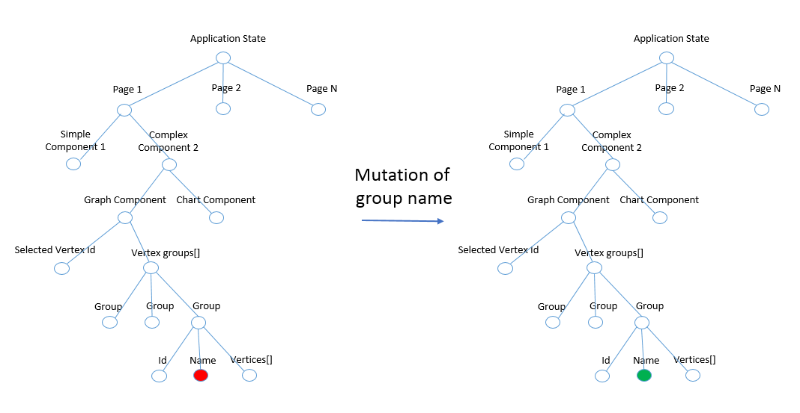
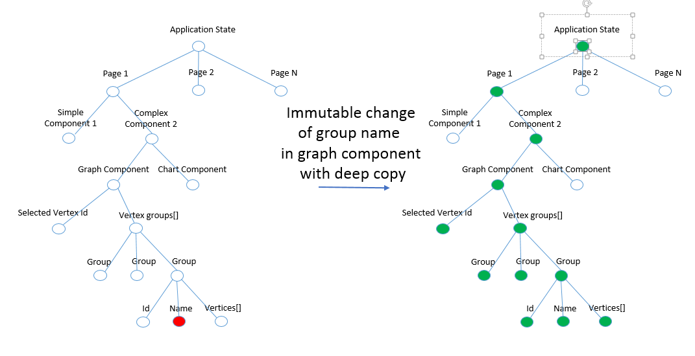
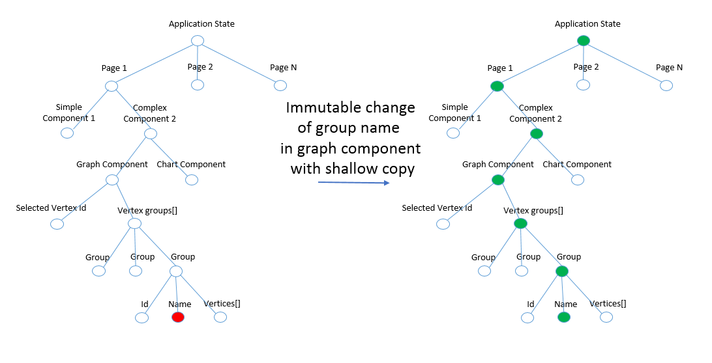

# FUN-Model

* is pure functional implementation of FLUX architecture
* Why FUN?
 * f - functional
 * u - unidirectional
 * n - whatever
 * model - just Model or ViewModel

## Resources
* [Bobril](https://github.com/Bobris/Bobril),
* [Flux](https://facebook.github.io/flux/docs/overview.html#content),
* [Reflux](https://github.com/spoike/refluxjs),
* [Redux](https://github.com/gaearon/redux)
 * reducers + flux
 * immutability
 * pure functionality
 * https://www.youtube.com/watch?v=xsSnOQynTHs

## Wiki
* [Bobflux](https://github.com/karelsteinmetz/bobflux)

## Notes
### Common keywords
* 1 store with 1 global application state
* application state is composition of sub states
* cursors are pointers to sub states
* action calls handler function with specific cursor
 * immutability
 * replaces part of global state
 * creates new instance of state
* Bobril and React are only rendering tools
 * "components are stateless"
* support for unit testing
* we need rendering (frame) for each visible modification

## Lifecycle
* Store - persists global application state
* Views/Pages - GUI stateless components
* Actions - creates new state or sub states for global application state
  * Cursors - pointers to sub states
  * Handlers - new state creators which get current state for specific cursor and give new instance of the same state type
* Action creator
  * gets state for handlers by cursor from global state
  * sets new state from handlers
  * if new state isn't same as previous frame then calls render for new frame


### Immutable or Mutable?
* immutable object is an object that has sub objects which can't be never mutated
* otherwise if you have mutable object you can do everything with its sub objects
* e.g. push new item into array:
 * mutable:
 ```
 let newLength = array.push(newItem)
 ```
 * immutable:
   * just create new array
  ```
  let newInstanceOfArrayState = [...oldArrayState, newItem]; // it's pretty easy  
  let oldStateAsSameInstance = [...oldArrayState]; // beware doesn't work  
  ```

#### The common mutability
* let's call action which changes name of third group in graph component
* green balls marks which instances are created again



* next frame renders all components of application (we haven't got router for page 1 to page N)
* router might be optimization for question. What should be rendered again in next frame?
  * renders only one page which is derived from current URL
* what we can do with page rendering optimization?
 * immutability and instance comparing might be option???

#### The immutability with deep copy
* green balls mark which instances are created again
* we make decision in next frame what should be rendered again?
 * we create comparing between current state or sub state with previous state or sub state
 * when states are same we don't need rendering
 * when states aren't same we need rendering



* when we imagine that every green balls is component which consists of complex DOM structure then all will be rendered. But some balls rendering is unnecessary because they haven't changes in their state, correct???
* shallow copy in action creator might be optimization

#### The immutability with shallow copy
* green balls marks which instances are created again



* we make decision in next frame what should be rendered again?
 * we create comparing between current state or sub state with previous state or sub state
 * when states are same we don't need rendering
 * when states aren't same we need rendering
